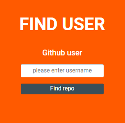

# Task
Created during recruitment process I am taking part at.

## The tools which have been used here:

* Figma
* Flexbox
* SASS
* Visial Studio Code
* git
* JavaScript
* ...

To run:

1. git clone https://github.com/kakuliniec/Task.git
2. Npm install
3. Npm start

**E n j o y !** 😉 

